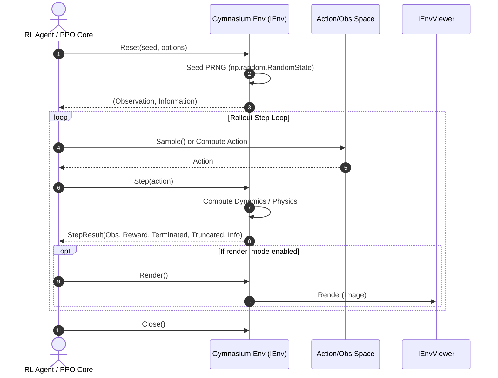
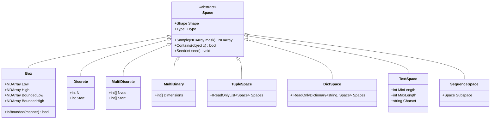

# Architecture: Core Lifecycle & Spaces Hierarchy

[Back to Documentation Index](../README.md) · [View PRD](../PRD.md)

---

## 1. Core Lifecycle Overview

The core environment abstraction in `Gym.NET` centers upon `IEnv` and the base `Env` class, establishing the standardized reinforcement learning interaction loop.



---

## 2. The 5-Tuple Step & 2-Tuple Reset Contract

### 2.1 `ResetResult` (2-Tuple)
```csharp
namespace Gym.Core {
    public readonly record struct ResetResult(
        NDArray Observation,
        Dict Information
    ) {
        public void Deconstruct(out NDArray observation, out Dict information) {
            observation = Observation;
            information = Information;
        }
    }
}
```

### 2.2 `StepResult` (5-Tuple)
```csharp
namespace Gym.Core {
    public readonly record struct StepResult(
        NDArray Observation,
        float Reward,
        bool Terminated,
        bool Truncated,
        Dict Information
    ) {
        public void Deconstruct(
            out NDArray observation,
            out float reward,
            out bool terminated,
            out bool truncated,
            out Dict information
        ) {
            observation = Observation;
            reward = Reward;
            terminated = Terminated;
            truncated = Truncated;
            information = Information;
        }

        public bool Done => Terminated || Truncated;
    }
}
```

---

## 3. Spaces Hierarchy

Gymnasium provides 10 standard spaces for observation and action representation:



### 3.1 Space Implementation Invariants
- **Deterministic Sampling**: `space.Seed(seed)` enforces reproducible random generation.
- **Type Bounds Safety**: Values sampled from `Box` are guaranteed to reside within $[Low, High]$.
- **Action Masking**: `Discrete.Sample(mask)` accepts a boolean selector vector masking out invalid actions.
