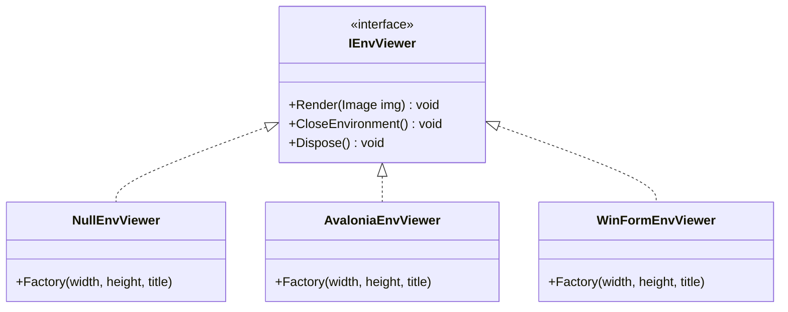

# Architecture: Decoupled Headless & GUI Rendering

[Back to Documentation Index](../README.md) · [View PRD](../PRD.md)

---

## 1. Design Overview

Rendering in `Gym.NET` is completely decoupled from core environment dynamics through the `IEnvViewer` interface and `IEnvironmentViewerFactoryDelegate` factory pattern.

---

## 2. Rendering Backends

### 2.1 `NullEnvViewer` (Headless First)
- **Target**: CI runners, server instances (Windows Server Core, Linux Docker containers), high-speed offline simulation.
- **Behavior**: Discards rendered frames with zero memory allocation or display server overhead.
- **Default**: Default viewer for all automated tests and headless reinforcement learning training.

### 2.2 `AvaloniaEnvViewer` (Cross-Platform GUI)
- **Target**: Windows, Linux, macOS desktop environments.
- **Technology**: Avalonia UI 0.10.22 / SkiaSharp.
- **Thread Safety**: Governed by `StaticAvaloniaApp` managing the desktop application lifetime and dispatching bitmap updates to UI threads asynchronously.

### 2.3 `WinFormEnvViewer` (Windows Desktop GUI)
- **Target**: Windows desktop environments.
- **Technology**: Windows Forms `PictureBox` / `ApplicationContext`.
- **Headless Guard**: Automatically falls back to non-interactive message loops when running under `SystemInformation.UserInteractive == false`.
