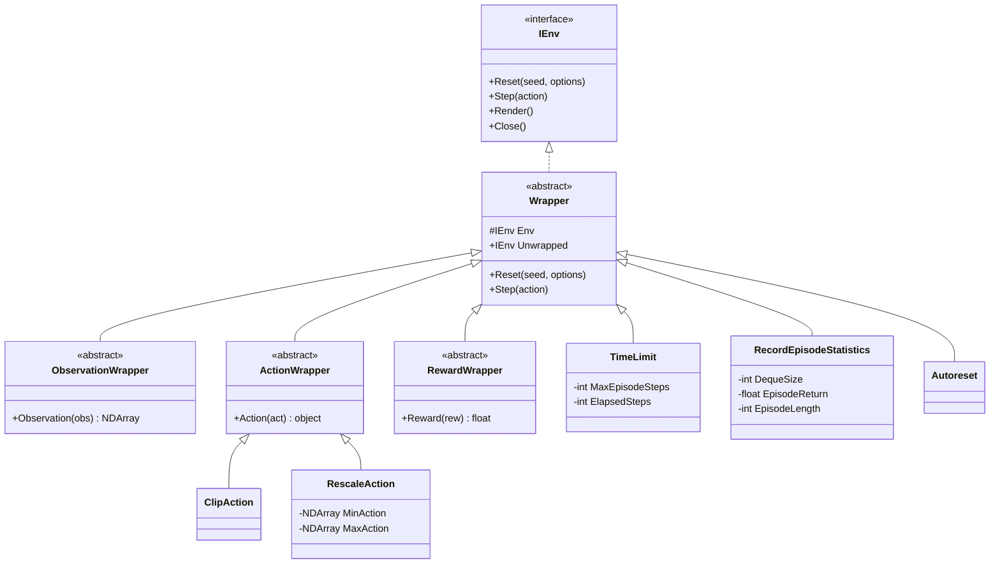

# Architecture: Wrapper Pipeline & Transformation Hierarchy

[Back to Documentation Index](../README.md) · [View PRD](../PRD.md)

---

## 1. Wrapper Architecture Overview

Wrappers in `Gym.NET` follow the **Decorator Pattern**, enabling modular, composable transformations on environment dynamics, observations, actions, and rewards without modifying concrete environment code.



---

## 2. Standard Wrapper Specifications

### 2.1 `TimeLimit`
- **Purpose**: Restricts episode execution to a maximum step horizon $H$.
- **Behavior**: When `_elapsedSteps >= _maxEpisodeSteps`, sets `step.Truncated = true`.
- **Mathematical Significance**: Allows Value Function bootstrapping at episode horizon termination ($V(s_H)$) rather than treating the boundary as an MDP terminal state.

### 2.2 `TransformObservation` & `TransformReward`
- **Purpose**: Applies functional scaling, normalization, or feature extraction delegates.
- **Example**:
  ```csharp
  var normalizedEnv = new TransformObservation(env, obs => (obs - mean) / std);
  ```

### 2.3 `RecordEpisodeStatistics`
- **Purpose**: Aggregates episode metrics for monitoring RL training convergence.
- **Injected Metadata**: `info["episode"] = { "r": total_return, "l": episode_length, "t": elapsed_seconds }`.

### 2.4 `Autoreset`
- **Purpose**: Automatically invokes `env.Reset()` when `terminated || truncated` occurs during `Step()`.
- **Preserved Observation**: Stores the terminal transition state in `info["final_observation"]`.
