# Plan: Gym.NET Migration to Farama Gymnasium (SOT), PRD, Roadmap, and Live Documentation

## Context

`Gym.NET` is a high-performance, native C# (.NET 8/10) port of reinforcement learning environment toolkits under the SciSharp STACK ecosystem. Within the larger quantitative trading and reinforcement learning architecture (`NT.sln`), `Gym.NET` serves as the foundational benchmark validation and environment suite for validating reinforcement learning algorithms (`PPO.Core`) and financial microstructure simulations (`HalfTick.Environment`).

The current codebase is built upon legacy OpenAI Gym patterns (pre-v0.26), which possess significant architectural shortcomings:
1. **Legacy Step Contract**: 4-tuple `(Observation, Reward, Done, Information)`, conflating Markov Decision Process (MDP) terminal conditions with time-limit/out-of-bounds truncations.
2. **Legacy Reset Contract**: `Reset()` returns only `NDArray Observation`, discarding initial environment diagnostic metadata.
3. **Incomplete Space Suite**: Only `Box` and `Discrete` are implemented, lacking `MultiDiscrete`, `MultiBinary`, `Tuple`, `Dict`, `Text`, and `Sequence`.
4. **Lack of Standard Wrappers**: No standard transformation or monitoring wrapper hierarchy (`TimeLimit`, `TransformObservation`, `TransformReward`, `ClipAction`, `RecordEpisodeStatistics`, `Autoreset`).
5. **Outdated Vector Environments**: Minimal vectorization lacking modern Gymnasium autostep/autoreset mechanics and `final_observation` retention.

This plan details the full migration of `Gym.NET` to **Farama Gymnasium** (`refs/Gymnasium`) as the canonical Source of Truth (SOT), ensuring 100% mathematical, behavioral, and architectural parity while enforcing strict **Test-Driven Development (TDD)**, **SOLID principles**, and **Object Calisthenics**.

---

## 1. Product Requirements Document (PRD)

### 1.1 Core Lifecycle Requirements

- **FR-01: Modern `Reset` Contract**:
  - Signature: `(NDArray Observation, Dict Information) Reset(int? seed = null, Dict options = null)`.
  - Calling `Reset(seed)` resets and synchronizes the internal pseudo-random number generator (`np.random.RandomState(seed)`).
  - Returns a strongly-typed or deconstructible tuple of observation array and initial metadata dictionary.

- **FR-02: Modern 5-Tuple `Step` Contract**:
  - Signature: `StepResult Step(object action)` supporting 5-tuple deconstruction:
    ```csharp
    var (observation, reward, terminated, truncated, info) = env.Step(action);
    ```
  - `terminated` (`bool`): True if the environment reached a natural terminal state (e.g. pole fell, agent reached goal).
  - `truncated` (`bool`): True if the episode was halted due to an external condition (e.g. `TimeLimit` max steps reached, out-of-bounds limit).

- **FR-03: Spaces Suite Complete Parity**:
  - `Box`: Continuous multi-dimensional bounded/unbounded intervals with vectorized sampling (`normal`, `exponential`, `uniform`).
  - `Discrete`: Categorical integer space `{start, ..., start + n - 1}` with action masking support.
  - `MultiDiscrete`: Vector of discrete categorical dimensions, each with independent bounds.
  - `MultiBinary`: Multi-dimensional binary arrays with values in $\{0, 1\}$.
  - `TupleSpace`: Cartesian product of arbitrary heterogeneous subspaces.
  - `DictSpace`: Key-value mapped composite subspaces.
  - `TextSpace`: Bounded/variable-length character string space.
  - `SequenceSpace`: Variable-length sequences of subspace elements.
  - `GraphSpace`: Structured graph spaces containing node, edge, and link features.
  - `OneOfSpace`: Exclusive union of alternative subspaces.

- **FR-04: Wrapper Architecture**:
  - Base classes: `Wrapper`, `ObservationWrapper`, `ActionWrapper`, `RewardWrapper`.
  - Standard implementations:
    - `TimeLimit`: Enforces maximum episode step bounds and sets `truncated = true`.
    - `TransformObservation`: Applies custom functional transformations to observations.
    - `TransformReward`: Applies functional scaling/clipping to rewards.
    - `ClipAction`: Clips continuous actions to action space bounds.
    - `RescaleAction`: Maps continuous actions affine-transformed to custom ranges (e.g. $[-1, 1]$).
    - `RecordEpisodeStatistics`: Tracks cumulative episode rewards and lengths in `info["episode"]`.
    - `Autoreset`: Automatically invokes `Reset()` upon termination/truncation.
    - `OrderEnforcing`: Enforces that `Reset()` is invoked prior to `Step()`.

- **FR-05: Vector Environments**:
  - `VectorEnv`: Base vectorized environment abstraction.
  - `SyncVectorEnv`: Sequential batch execution across $N$ environment instances.
  - `AsyncVectorEnv`: Parallel batch execution across worker threads/tasks.
  - Autoreset semantics: Automatically captures `final_observation` in `info` when sub-environments terminate while continuing seamless rollout batching.

- **FR-06: Classical & Box2D Physics Environments**:
  - `CartPole-v1`: Discrete classic control balancing cart and pole.
  - `Pendulum-v1`: Continuous torque control pendulum swing-up.
  - `MountainCar-v0`: Underpowered car mountain ascent.
  - `MountainCarContinuous-v0`: Continuous power mountain ascent.
  - `Acrobot-v1`: Two-link double pendulum.
  - `LunarLander-v3`: Discrete and Continuous 2D lunar lander physics simulation (via `Aether.Physics2D`).
  - `BipedalWalker-v3`: 4-joint bipedal locomotion robot.

- **FR-07: Headless & Decoupled Rendering Pipeline**:
  - Configurable `render_mode` on environment construction (`"human"`, `"rgb_array"`, `null`).
  - Zero hard dependencies on GUI frameworks in core environment logic.
  - Pluggable `IEnvViewer` backends:
    - `NullEnvViewer`: Headless frame discarding for high-speed simulation & CI.
    - `AvaloniaEnvViewer`: Hardware-accelerated cross-platform GUI window (`Gym.Rendering.Avalonia`).
    - `WinFormEnvViewer`: Windows Forms desktop window (`Gym.Rendering.WinForm`).

---

## 2. Engineering Standards & Quality Constraints

### 2.1 Test-Driven Development (TDD)
- **Red-Green-Refactor Cycle**: Unit tests written and verified against SOT before implementing domain features.
- **Golden Reference Testing**: Verification suites that execute deterministic seed rollouts against Farama Gymnasium Python trajectories to guarantee numerical bit-parity.
- **Immutable Tests**: Test assertions derived from SOT physics/math specifications are immutable contracts.

### 2.2 SOLID Principles
- **Single Responsibility (SRP)**: Segregate observation calculation, physics integration, reward calculation, and viewer rendering into focused classes.
- **Open/Closed (OCP)**: Extend environment capabilities via `Wrapper` composition rather than modifying concrete environment classes.
- **Liskov Substitution (LSP)**: All concrete environments and wrappers must satisfy `IEnv` and generic `IEnv<TObs, TAct>` contracts without surprising side effects.
- **Interface Segregation (ISP)**: Focused interfaces (`IEnv`, `ISpace`, `IWrapper`, `IVectorEnv`, `IEnvViewer`).
- **Dependency Inversion (DIP)**: Environments depend upon abstract viewers via `IEnvironmentViewerFactoryDelegate`, enabling headless testing.

### 2.3 Object Calisthenics
1. **One level of indentation per method**: Extract nested loops/conditionals into private descriptive methods.
2. **Never use the `else` keyword**: Guard clauses, early returns, and polymorphic strategy dispatch.
3. **Wrap domain primitives**: Wrap scalars and raw arrays in strongly typed Value Objects (`Observation`, `Action`, `Reward`, `EpisodeStats`).
4. **First-class collections**: Classes containing collections must encapsulate collection behavior without extraneous properties.
5. **One dot per line**: Demeter compliance across all submodules.
6. **No abbreviations**: Use explicit identifiers (`observation`, `terminated`, `truncated`, `actionSpace`).
7. **Keep entities small**: Target classes $\le 100$ lines, methods $\le 15$ lines.
8. **No bare getters/setters**: Expose domain behavior instead of mutable data structures (*Tell, Don't Ask*).

---

## 3. Migration Roadmap & Implementation Phases

```
Phase 1: Core Contracts & Spaces Modernization
├── Task 1.1: Core Lifecycle Modernization (IEnv, Env, StepResult 5-tuple, Reset 2-tuple)
├── Task 1.2: Spaces Suite Completion (MultiDiscrete, MultiBinary, TupleSpace, DictSpace, TextSpace, SequenceSpace)
└── Task 1.3: Spaces Test Suite (Golden sampling, bounds, containment tests)

Phase 2: Wrapper Pipeline & Vector Environments
├── Task 2.1: Wrapper Base Hierarchy (Wrapper, ObservationWrapper, ActionWrapper, RewardWrapper)
├── Task 2.2: Standard Wrappers Suite (TimeLimit, TransformObservation, TransformReward, ClipAction, RecordEpisodeStatistics, Autoreset)
└── Task 2.3: Vector Environments (VectorEnv, SyncVectorEnv, AsyncVectorEnv with autoreset semantics)

Phase 3: Classical Control & Physics Environments
├── Task 3.1: Classical Control Suite (CartPole-v1, Pendulum-v1, MountainCar-v0, MountainCarContinuous-v0, Acrobot-v1)
├── Task 3.2: Box2D / Physics Suite (LunarLander-v3, BipedalWalker-v3)
└── Task 3.3: Golden Trajectory SOT Parity Tests

Phase 4: Live Documentation Hub & Agent Graph
├── Task 4.1: Central Documentation Hub (docs/README.md, docs/architecture/, docs/sot/, PRD.md, ROADMAP.md)
└── Task 4.2: Machine-Readable Graph (docs/architecture/ontology.json & Mermaid Architecture)
```

---

## 4. Gap Analysis & Closure Matrix

| OpenAI Gym (Legacy Gym.NET) | Farama Gymnasium (Target SOT) | Migration Action |
| :--- | :--- | :--- |
| `NDArray Reset()` | `(NDArray Obs, Dict Info) reset(seed, options)` | Upgrade `IEnv.Reset` to return `(NDArray, Dict)` accepting `int? seed` and `Dict options`. |
| `Step Step(action)` -> `(Obs, Reward, Done, Info)` | `step(action)` -> `(Obs, Reward, Terminated, Truncated, Info)` | Replace `Step` with `StepResult` record returning 5-tuple with `Terminated` and `Truncated`. |
| Only `Box` and `Discrete` spaces | Full space suite (10+ spaces) | Implement `MultiDiscrete`, `MultiBinary`, `TupleSpace`, `DictSpace`, `TextSpace`, `SequenceSpace`. |
| No standardized wrapper base classes | `Wrapper`, `ObservationWrapper`, `ActionWrapper`, `RewardWrapper` | Create `src/Gym/Wrappers/` with standard wrapper hierarchy. |
| `VecEnv`, `DummyVecEnv` without autoreset | `VectorEnv`, `SyncVectorEnv`, `AsyncVectorEnv` | Modernize vector environments with batching and `final_observation` tracking. |
| Only `CartPole` and `LunarLander` | `CartPole-v1`, `Pendulum-v1`, `MountainCar`, `Acrobot`, `LunarLander`, `BipedalWalker` | Implement missing classical control and physics environments. |
| Per-call `Render(mode)` | Construction `render_mode` (`"human"`, `"rgb_array"`) | Configure `render_mode` on initialization; decouple viewer factories. |

---

## 5. Machine-Readable Agent Ontology & Dependency Graph

### 5.1 Mermaid Architecture Graph

```mermaid
graph TD
    subgraph Core ["Gym.Core (src/Gym/)"]
        IEnv["IEnv / Env Base"]
        StepResult["StepResult (Obs, Rew, Term, Trunc, Info)"]
        ResetResult["ResetResult (Obs, Info)"]
        IEnv --> StepResult
        IEnv --> ResetResult
        Spaces["Spaces Hierarchy"]
        Spaces --> Box["Box Space"]
        Spaces --> Discrete["Discrete Space"]
        Spaces --> MultiDiscrete["MultiDiscrete Space"]
        Spaces --> MultiBinary["MultiBinary Space"]
        Spaces --> TupleSpace["TupleSpace"]
        Spaces --> DictSpace["DictSpace"]
        Spaces --> TextSpace["TextSpace"]
        Spaces --> SequenceSpace["SequenceSpace"]
    end

    subgraph Wrappers ["Gym.Wrappers (src/Gym/Wrappers/)"]
        WrapperBase["Wrapper Base"] --> IEnv
        WrapperBase --> TimeLimit["TimeLimit (Truncation)"]
        WrapperBase --> ObsWrap["ObservationWrapper (TransformObs)"]
        WrapperBase --> ActWrap["ActionWrapper (ClipAction, RescaleAction)"]
        WrapperBase --> RewWrap["RewardWrapper (TransformReward)"]
        WrapperBase --> StatsWrap["RecordEpisodeStatistics"]
        WrapperBase --> AutoReset["Autoreset"]
    end

    subgraph Vector ["Gym.Vector (src/Gym/Vector/)"]
        VectorEnv["VectorEnv Base"] --> SyncVectorEnv["SyncVectorEnv"]
        VectorEnv --> AsyncVectorEnv["AsyncVectorEnv"]
        SyncVectorEnv --> AutoBatch["Autostep & FinalObs Tracking"]
    end

    subgraph Envs ["Gym.Environments (src/Gym.Environments/)"]
        CartPole["CartPole-v1"] --> IEnv
        Pendulum["Pendulum-v1"] --> IEnv
        MountainCar["MountainCar-v0 / Continuous"] --> IEnv
        Acrobot["Acrobot-v1"] --> IEnv
        LunarLander["LunarLander-v3"] --> IEnv
        BipedalWalker["BipedalWalker-v3"] --> IEnv
    end

    subgraph Rendering ["Gym.Rendering (Decoupled Viewers)"]
        IEnvViewer["IEnvViewer"]
        NullEnvViewer["NullEnvViewer (Headless)"] --> IEnvViewer
        AvaloniaViewer["AvaloniaEnvViewer (Cross-Platform)"] --> IEnvViewer
        WinFormViewer["WinFormEnvViewer (Windows)"] --> IEnvViewer
        Envs --> IEnvViewer
    end

    subgraph SOT ["Master Source of Truth (refs/Gymnasium)"]
        GymnasiumPython["Farama Gymnasium Python SOT"] -.->|Mathematical Parity| Core
        GymnasiumPython -.->|Physics & Dynamics Parity| Envs
    end
```



### 5.2 Machine-Readable Agent Ontology (`docs/architecture/ontology.json`)

```json
{
  "system": "Gym.NET",
  "version": "1.0.0-gymnasium",
  "sot": {
    "repository": "refs/Gymnasium",
    "upstream": "https://github.com/Farama-Foundation/Gymnasium",
    "version": "1.0.0",
    "standards": ["FARAMA_GYMNASIUM_API_SPEC", "TDD", "SOLID", "OBJECT_CALISTHENICS"]
  },
  "modules": [
    {
      "name": "Gym.Core",
      "path": "src/Gym",
      "contracts": [
        { "name": "IEnv", "type": "interface", "methods": ["Reset", "Step", "Render", "Close"] },
        { "name": "StepResult", "type": "record", "properties": ["Observation", "Reward", "Terminated", "Truncated", "Information"] },
        { "name": "ResetResult", "type": "record", "properties": ["Observation", "Information"] }
      ],
      "spaces": ["Box", "Discrete", "MultiDiscrete", "MultiBinary", "TupleSpace", "DictSpace", "TextSpace", "SequenceSpace", "GraphSpace", "OneOfSpace"]
    },
    {
      "name": "Gym.Wrappers",
      "path": "src/Gym/Wrappers",
      "wrappers": ["TimeLimit", "TransformObservation", "TransformReward", "ClipAction", "RescaleAction", "RecordEpisodeStatistics", "Autoreset", "OrderEnforcing"]
    },
    {
      "name": "Gym.Vector",
      "path": "src/Gym/Vector",
      "vector_envs": ["SyncVectorEnv", "AsyncVectorEnv"]
    },
    {
      "name": "Gym.Environments",
      "path": "src/Gym.Environments",
      "environments": [
        { "id": "CartPole-v1", "category": "classic_control", "obs_dim": 4, "action_type": "Discrete(2)" },
        { "id": "Pendulum-v1", "category": "classic_control", "obs_dim": 3, "action_type": "Box(-2, 2, (1,))" },
        { "id": "MountainCar-v0", "category": "classic_control", "obs_dim": 2, "action_type": "Discrete(3)" },
        { "id": "MountainCarContinuous-v0", "category": "classic_control", "obs_dim": 2, "action_type": "Box(-1, 1, (1,))" },
        { "id": "Acrobot-v1", "category": "classic_control", "obs_dim": 6, "action_type": "Discrete(3)" },
        { "id": "LunarLander-v3", "category": "box2d", "obs_dim": 8, "action_type": "Discrete(4) | Box(-1, 1, (2,))" },
        { "id": "BipedalWalker-v3", "category": "box2d", "obs_dim": 24, "action_type": "Box(-1, 1, (4,))" }
      ]
    },
    {
      "name": "Gym.Rendering",
      "viewers": [
        { "name": "NullEnvViewer", "type": "headless", "target": "all" },
        { "name": "AvaloniaEnvViewer", "type": "gui_cross_platform", "target": "desktop" },
        { "name": "WinFormEnvViewer", "type": "gui_windows", "target": "windows_desktop" }
      ]
    }
  ]
}
```

---

## 6. Live Documentation Structure Blueprint (`docs/`)

The documentation hub will be organized under `docs/`:
```
docs/
├── README.md                      # Central Documentation Index & Quickstart
├── PRD.md                         # Product Requirements Document
├── ROADMAP.md                     # Live Milestone Roadmap & Deliverables Matrix
├── architecture/
│   ├── core_lifecycle_and_spaces.md   # StepResult, Reset, Space hierarchy
│   ├── wrapper_architecture.md        # Transformation pipeline & monitoring
│   ├── vector_environments.md         # Synchronous & asynchronous vectorization
│   ├── decoupled_rendering.md         # Headless NullEnvViewer vs Avalonia/WinForm
│   └── ontology.json                  # Machine-readable architecture & agent ontology
├── sot/
│   ├── gymnasium_sot_mapping.md       # Farama Gymnasium API mapping & parity spec
│   └── golden_trajectory_baseline.md  # Deterministic test baselines & trajectories
└── guides/
    ├── development_and_testing.md     # TDD workflow, build & test commands
    └── creating_custom_environments.md# Guide for authoring new Gymnasium C# environments
```

---

## 7. Verification & End-to-End Testing Strategy

1. **Unit Testing Pyramid**:
   - `SpaceTests`: Bound checks, `Contains(x)`, `Sample(mask)`, seed reproducibility for all spaces.
   - `WrapperTests`: Verify `TimeLimit` truncation, observation/reward transformations, and statistics aggregation.
   - `VectorEnvTests`: Batch stepping, async execution, autoreset observation integrity.
   - `EnvironmentDynamicsTests`: Mathematical dynamics, Euler kinematics, physics contacts, reward functions.

2. **Golden SOT Trajectory Verification**:
   - Automated MSTest test methods that run deterministic seeded trajectories ($N=1000$ steps) comparing step transitions, rewards, and terminations against Python Gymnasium golden output.

3. **Solution Build & Test Execution**:
   ```powershell
   # Build solution
   dotnet build Gym.NET.sln -c Release

   # Run complete test suite across .NET 8 and .NET 10
   dotnet test Gym.NET.sln -c Release
   ```
